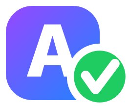

# Grammar Corrector



A tiny macOS menu bar app that fixes grammar and spelling with Google Gemini, in any app.

[](https://buymeacoffee.com/thua9678)

Select text anywhere, press **⇧⌘C**, and it's replaced with the corrected version. Then a panel pops up showing what was wrong and why. **Mentions and formatting survive** in Slack and Asana.

## Features

- **Fix in place, in any app.** A global shortcut (default ⇧⌘C, configurable) copies the selection, corrects it, pastes it back, and restores your clipboard.
- **Learn from your mistakes.** After a fix, the panel lists every change (~~wrong~~ → **right**) with a one-line explanation.
- **Keeps Slack & Asana mentions, links, bold and code.** It reads Slack's editor data (`slack/texty`) and Asana's HTML, fixes only the words, and pastes back the same rich format.
- **Respects chat style.** If your text starts lowercase, it's treated as a casual message: grammar and spelling get fixed, but it isn't capitalized and no period is added.
- **Menu bar panel** for pasting text and checking it by hand (⌘↩).
- **Fast.** About 2 s per check with Gemini Flash at low thinking. Flash-Lite and Pro are selectable.
- API key stored in the macOS Keychain. Open at login. No Dock icon.

## Requirements

- macOS 14 or later
- Xcode or the Swift 5.9+ command line tools
- A Gemini API key: [aistudio.google.com/apikey](https://aistudio.google.com/apikey)

## Download

Grab `GrammarCorrector-<version>.zip` from [Releases](https://github.com/thuann-vn/grammar-corrector/releases), unzip it, and move **GrammarCorrector.app** to `/Applications`. It's a universal build for Apple Silicon and Intel.

The release isn't notarized by Apple, so macOS blocks it the first time. Either right-click the app → **Open** → **Open**, or run:

```bash
xattr -dr com.apple.quarantine /Applications/GrammarCorrector.app
```

## Build & install from source

```bash
git clone https://github.com/thuann-vn/grammar-corrector.git
cd grammar-corrector
./build-app.sh            # builds, signs, installs to /Applications and launches
```

`INSTALL=0 ./build-app.sh` only builds `build/GrammarCorrector.app`.

**Code signing.** The fix-in-place shortcut needs the **Accessibility** permission, and macOS ties that permission to the app's signature. The script signs with your first *Apple Development* certificate, or the one in `SIGN_IDENTITY`, so the permission survives rebuilds. Without a certificate the app is signed ad-hoc and you must re-grant the permission after every build. To create a free certificate: Xcode → Settings → Accounts → Manage Certificates → **+** → Apple Development.

## Setup

1. Click the menu bar icon, open ⚙️ Settings, and paste your Gemini API key.
2. Press the shortcut once and allow **Grammar Corrector** in System Settings → Privacy & Security → **Accessibility**. This lets it press ⌘C/⌘V for you.
3. Optional: turn on **Open at login**, or change the shortcut.

## How rich text is preserved

The model never sees markup. Everything that isn't prose is replaced with numbered placeholders before the text is sent:

```
hi ⟦0⟧ i checke the task ⟦1⟧ and we can hanel ⟦2⟧
```

In this example, `⟦0⟧` is a mention, `⟦1⟧` a task link and `⟦2⟧` inline code. Bold and italic runs get an open/close placeholder pair, so their words can still be corrected. The response is accepted only if every placeholder comes back exactly once and in order. Then the original markup is restored and written back to the pasteboard in the source app's own format. If the placeholders are broken twice in a row, **nothing is pasted**.

| Source | Pasteboard format used | Code |
|---|---|---|
| Slack | `org.chromium.web-custom-data` → `slack/texty` (Quill delta) | [SlackTexty.swift](Sources/GrammarCorrector/SlackTexty.swift) |
| Asana and other HTML editors | `public.html` | [RichText.swift](Sources/GrammarCorrector/RichText.swift) |
| Everything else | plain text | [CheckerModel.swift](Sources/GrammarCorrector/CheckerModel.swift) |

## Privacy

Selected text is sent to the Google Gemini API for correction and is subject to [Google's API terms](https://ai.google.dev/gemini-api/terms). Nothing else leaves your Mac. The app has no telemetry. Logs (`log stream --predicate 'subsystem == "com.local.GrammarCorrector"'`) record only character counts, never your text.

## Project layout

```
Sources/GrammarCorrector/
  App.swift            menu bar item + popover
  ContentView.swift    panel and settings UI
  CheckerModel.swift   state, copy → fix → paste flow
  GeminiClient.swift   Gemini API call (structured JSON output)
  RichText.swift       placeholder masking, HTML
  SlackTexty.swift     Chromium custom data + Slack delta
  HotKey.swift         global shortcut, synthetic ⌘C/⌘V
  Shortcut.swift       shortcut recorder model
  MenuBarIcon.swift    drawn menu bar icon
  Keychain.swift, LaunchAtLogin.swift
```

## Support

Grammar Corrector is free and open source. If it saves you time, you can [buy me a coffee](https://buymeacoffee.com/thua9678).

## License

[MIT](LICENSE)
